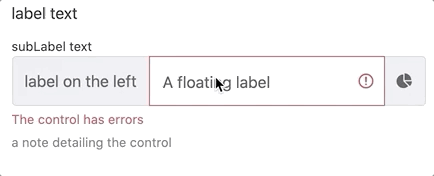
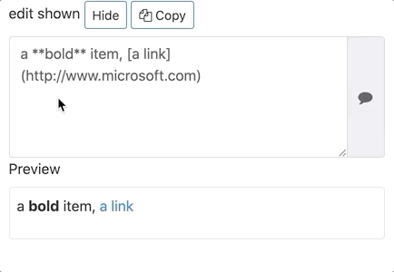
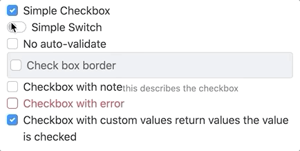
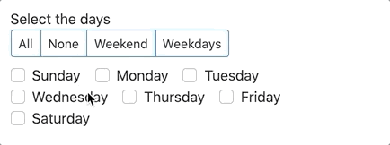

# ngx-d-components

ngx-d-components are a set of Angular (8+) Boostrap 4.x based components.  These include form controls, modals, toasts, widgets and more.

[dex-img]: https://dataexpertsgroup.com/assets/img/dex_web_logo.png
[dex]: https://dataexpertsgroup.com

[![][dex-img]][dex]

[dex-img]: https://dataexpertsgroup.com/img/dex_web_logo.png
[dex]: https://dataexpertsgroup.com

[](https://www.npmjs.com/package/ngx-d-components)
[](https://travis-ci.org/DataExperts/ngx-d-components)

## Features

* Decorated form controls including input, dropdown, tag input/dropdown, checkbox, textarea, etc.
* Auto expanding button controls.
* Animated Progress.
* Dialogs for information, confirmation, input.
* Animated toasts.
* Customizable Widgets (based on the Bootstrap cards.).

## Demo

A demo site for the various components is available here:

https://dataexperts.github.io/Dexih.Libraries/demo/components

## Releases Summary

[Older release information](releases.md)

## Installation

To install this library, run:

```bash
$ npm install ngx-d-components --save
```
> Note: ngx-d-table also installs ngx-d-markdown, marked.js & prismjs

Ensure the `BrowserAnimationsModule` and `HttpClientModule` have been included in your app.module.ts.  Here is a sample version:

```typescript
import { BrowserModule } from '@angular/platform-browser';
import { BrowserAnimationsModule } from '@angular/platform-browser/animations';
import { HttpClientModule } from '@angular/common/http';
import { NgModule } from '@angular/core';

import { AppRoutingModule } from './app-routing.module';
import { AppComponent } from './app.component';
import { DComponentsModule} from 'ngx-d-components';

@NgModule({
  declarations: [
    AppComponent
  ],
  imports: [
    BrowserModule,
    BrowserAnimationsModule,
    HttpClientModule,
    AppRoutingModule,
    DComponentsModule,
  ],
  providers: [],
  bootstrap: [AppComponent]
})
export class AppModule { }
```

You will need also need bootstrap styles included (4.x).  For example add this to your index.html header:

```xml
<!-- index.html -->
<link rel="stylesheet" href="https://stackpath.bootstrapcdn.com/bootstrap/4.5.0/css/bootstrap.min.css" integrity="sha384-9aIt2nRpC12Uk9gS9baDl411NQApFmC26EwAOH8WgZl5MYYxFfc+NcPb1dKGj7Sk" crossorigin="anonymous">
```

> Note: jQuery, popper and the bootstrap.js files (which are usually required for Bootstrap 4.x) are not required for these controls to function.

## Example

## Form Controls

The form controls can either be setup in reactive forms or through templates.  For detailed documentation on forms see the ["Introduction to forms in Angular"](https://angular.io/guide/forms-overview).

The following sample shows how to use the controls as a reactive form:
```typescript
import { Component } from '@angular/core';
import { FormControl } from '@angular/forms';

@Component({
  selector: 'app-reactive-favorite-color',
  template: `
    Favorite Color: <form-input label="Enter favorite color" type="text" [formControl]="favoriteColorControl"></form-input>
  `
})
export class FavoriteColorComponent {
  favoriteColorControl = new FormControl('');
}
```

The following sample shows how to use the controls in a template driven form:

```typescript
import { Component } from '@angular/core';

@Component({
  selector: 'app-template-favorite-color',
  template: `
    Favorite Color: <form-input label="Enter favorite color"  type="text" [(ngModel)]="favoriteColor"></form-input>
  `
})
export class FavoriteColorComponent {
  favoriteColor = '';
}
```


The form controls all have the following basic attributes:

* `label` - A label above the main control.
* `subLabel` - A label in smaller text under the label.
* `labelLeft` - A label directly to the left and on the same line as the main control
* `floatingLabel` - A label inside the inputs `placeholder` and then moves upward when a value is entered.  Note, a floating control impact the controls height.
* `placeholder` - The placeholder in the control when no value has been entered.  Note, this is ignored when a floatingLabel is set.
* `note` - A note in smaller text under the main control.
* `border` (true/false) - Displays or hides the controls border.

* `errors` - an error message displayed under the control in red.  If set the border will also be red, and an invalid icon will appear.
* `iconClass` - A class representing an icon to be displayed on the right side of the control
* `autocapitalize` (boolean) - enable or disable auto capitalize on mobile devices.
* `disabled` - (boolean) - disable the control
* `autoValidate` - (boolean) - automatically validate the control with a green border and check when a valid value has been entered or changed.

The following example shows the basic layout of the form controls:

```xml
<form-input 
    label="label text"
    subLabel="subLabel text"
    labelLeft="label on the left"
    floatingLabel="A floating label"
    errors="The control has errors"
    iconClass="fa fa-pie-chart"
    note="a note detailing the control">
</form-input>
```
Displays the following 



> Note: In general it is recommended to either use the `label`, `labelLeft` or `floatingLabel` not all three combined as in the demo above.


### Input

The form-input provide a decorated input control.

Usage:

```xml
<form-input label="User Name" [(ngModel)]="userName" ></form-input>
```

The input control contains the following attributes:

* `type` - The input type, `text`, `number` or `password`. 
* `pattern` - Specifies a regular expression to check the input value against.
* `maxlength` - Specifies the maximum number of character for an input field.

The following event can be received

* `keyDown` - emits the value of any key pressed inside the input.

Returns: the text input as `string` or `number` if type = `number`.


### Input Tags


The tags control allows the user to add or remove tags.

```xml
<form-tags label="Enter Tags"  [(ngModel)]="tags"></form-tags>
```

The tags controls provides the following attributes:

* `type` - The input type, `text` or `number`.
* `maxlength` - Specifies the maximum number of character for an input field.

Returns: the tags as `string[]`.

### TextArea



A TextArea that can used to view and edit multiline text values.  Includes a preview which formats the data as markdown.

```xml
<form-textarea label="edit shown" [showCopy]="true" [isHidden]="false" [(ngModel)]="description"></form-textarea>
```

The controls provides the following attributes:

* `hideToggle` - Removes the toggle showing/hiding the editable textarea
* `isHidden` - Hides the editable textarea
* `rows` - Specifies the maximum number of rows.
* `showPreview` - Displays the preview (as markdown)
* `showCopy`- Displays a button which will copy the text to the clipboard.

Returns: the text input as `string`.

### Dropdown (select)

```xml
<form-select label="Simple Select (also allows text entry)" [value]="'item1'"
        [items]="['item1', 'item2','item3']" [enableTextEntry]="true" [(ngModel)]="description"></form-select>
```

The control provides the following attributes:

* `defaultItem` - Item included when list is empty.
* `allowNullSelect` (true/false) - Provide an item which will return null.
* `selectNullMessage` - The name used to describe the null item.
* `enableTextEntry` (true/false) - Enable values to be manually entered (rather then just selected from the list).
* `enableTextEntryMatch` - Will attempt to match a manually entered value to an item in the list.
* `enableKeySelect` - Returns the key value only (rather than the item value)
* `textEntryItems` - List of items that will be selected as text.
* `textEntryItemsTitle` - Header to describe the text entry items.
* `disabledNote` - Description in the dropdown when it is disabled.
* `textValue` (input and output) - The value of a manual entry or item selected from the `textEntryItems` list.
* `sortItems` - Sort the list alphabetically.
* `enableFilter` - When a value is manually entered the list will automatically filter by this value.
* `multiSelect` - Allow multiple values to be selected.  The selected values will appear as tags.
* `enableAddAll` - Include an `Add All` button.
* `enableRemoveAll` - Include a `Remove All` button.
* `setTextEntryToValue` - Automatically sets a manually entered value to a value in the list.
* `isOpen` - Opens or closes the dropdown.
* `showRefresh` - Shows a refresh button which will trigger the `onRefresh` event when clicked.
* `isRefreshing` - Shows an in progress value indicating that a refresh is in place.

The following properties can be used to determine the items to be displayed.

* `items` - An array containing the main items for the dropdown.
* `itemKey` - The property in the `items` array value that should be returned as the key.  If not specified the full item value will be used.
* `itemName` - The property in the `items` array value that should be displayed in the dropdown.  If not specified the full item value will be used.
* `itemTitle` - The property in the `items` array value that should be displayed as a tooltip in the dropdown.  If not specified, there will be no tooltip.
* `parentName` - The name property to be used for the parent.
* `childItems` - The property which points to the array of child items.
* `grandParentName` - The name property to be used for the grandparent.
* `grandChildItems` - The property which point to the array of parent items.

The controls provides the following events:

* `onShown` - When the dropdown is opened.
* `onRefresh` - When the refresh button is clicked (requires `showRefresh` to be true)

#### Displaying hierarchial data.

The following array contains a category --> food relationship.
```typescript
public items = "[
        {category: 'Fruit', items: ['apple', 'orange', 'banana']}, 
        {category: 'Vegetable', items: ['carrot', 'lettuce', 'celery']},
        {category: 'Meat', items: ['beef', 'chicken', 'fish']}
    ]"
```

To display this in the dropdown with header for the categories

```xml
<form-select label="Select with hierarchy" parentName='category' childItems='items' [items]="items"></form-select>
```

#### Displaying data with keys, names, descriptions

The following data contains keys, names, and descriptions.

```xml
public items="[
    {key:1, name:'apple', description: 'A sweet crisp fruit.'}, 
    {key:2, name:'banana', description: 'A long yellow fruit'}, 
    {key:3, name:'orange', description: 'An orange citrus fruit.'}]"
```

To display this in the dropdown use the following.  Note the `enableKeySelect` means only the key will be returned.

```xml
<form-select label="Select with hierarchy" [items]="items" itemKey='key' itemName='name' itemTitle='description' [enableKeySelect]="true" ></form-select>
```


### Dropdown tags

A simpler and faster version of the select which also includes the ability to specify a tag color. 

```xml
<form-tags-dropdown label="Simple Tags Dropdown" [value]="['item1']"
    [items]="['item1', 'item2','item3']" [enableAddAll]="true"></form-tags-dropdown>
```

The following properties are used for this control:

* `items` - An array containing the main items for the dropdown.
* `itemKey` - The property in the `items` array value that should be returned as the key.  If not specified the full item value will be used.
* `itemName` - The property in the `items` array value that should be displayed in the dropdown.  If not specified the full item value will be used.
* `itemColor` - The property in the `items` array value that should be used to color the item.
* `itemTitle` - The property in the `items` array value that should be displayed as a tooltip in the dropdown.  If not specified, there will be no tooltip.
* `sortItems` - Sort the list alphabetically.
* `isOpen` - Opens or closes the dropdown.
* `autoClose` - Closes the dropdown each time an item is clicked.

The controls provides the following events:

* `onShown` - When the dropdown is opened.
* `onRefresh` - When the refresh button is clicked (requires `showRefresh` to be true)


### Checkbox



The following properties are provided for this control:
* `isSwitch` - display the checkbox as a switch.
* `checkedValue` - the value to return when checked (default `true`);
* `unCheckedValue` - the value to return when unchecked (default `false`);

```xml
<form-checkbox label="Simple Checkbox" [value]="true"></form-checkbox>
```

### Date

An input that uses the browsers built in date capability.  If the browser does not support dates, then an input will be displayed that validates any input as a date.

Usage:

```xml
<form-date label="Simple date entry" value="2010-01-01" placeholder="input date"></form-date>
```
### Time

```xml
<form-time [label]="'time with label (' + selectedTime +')'" [(ngModel)]="selectedTime"
                            [ngModelOptions]="{standalone: true}"></form-time>
```

### Days Of Week



A series of check boxes that can be used for days of week selection.

```xml
<form-daysofweek label="Select the days"></form-daysofweek>
```
The following properties are used for this control:

`showHelper` - Displays buttons which allow weekday, weekend selection.

Returns an array containing the days of the week (e.g. saturday and sunday would return [0,6] )


## Buttons 

> Note: The built in buttons use Font Awesome 4.7 for the icons.  To use these you must include a referece to the Font Awsome css in your index.html file as follows:

  <link rel="stylesheet" href="https://cdnjs.cloudflare.com/ajax/libs/font-awesome/4.7.0/css/font-awesome.min.css">

All buttons have the following standard attributes:

* `buttonClass` - overrides the default class for the button (default `btn btn-primary`)
* `iconClass` - class for the icon
* `title` - the tooltip displayed
* `disabled` - disables the button
* `busy` - displays a animated wait icon.
* `text` - the text to display on the button
* `compact` - hides the text and only displays the icon.
* `autoCompact` - automatically hides and displays the text when the mouse moves over the top.
* `badge` - text to display in the button badge.
* `badgeClass` - text to display in the button badge (e.g. `badge-success`, `badge-danger`, `badge-info`)


### Regular Button

Usage: 

```xml
<d-button class="m-1" iconClass="fa fa-bar-chart" [autoCompact]="false">With Icon</d-button>
```

### Dropdown Button

The dropdown button opens a customisable dropdown.

The control contains the following additional attributes:

* `hideCarrot` - hides the down arrow (carrot) icon
* `isOpen` - opens the dropdown

Usage:
```xml
<d-button-dropdown class="m-1" text="drop down" [autoCompact]="false">
    <a class="dropdown-item">item 1</a>
    <a class="dropdown-item active">active item</a>
    <a class="dropdown-item">item 3</a>
</d-button-dropdown>
```

The `d-dropdown-item` control can also be used for items in the dropdown as follows:

```xml
<d-button-dropdown text="Testing" iconClass="fa fa-chain-broken" [pullRight]="true">
    <d-dropdown-item iconClass="fa fa-table" [routerLink]="['test', 'table']">Table Tests</d-dropdown-item>
    <d-dropdown-item [routerLink]="['test', 'components']">Component Tests</d-dropdown-item>
</d-button-dropdown>
```

The `d-dropdown-button` contains the following attributes:

* `iconClass` - class for the icon.
* `title` - tooltip to be displayed.
* `text` - the text for the item.
* `busy` - displays a animated wait icon.
* `badge` - text to display in the button badge.
* `badgeClass` - text to display in the button badge (e.g. `badge-success`, `badge-danger`, `badge-info`)


### Split/Dropdown Button

The split/dropdown is similar to the dropdown, except the button and the dropdown are split.

Usage:

```xml
<d-button-splitdropdown class="m-1" iconClass="fa fa-bar-chart" text="split" [autoCompact]="false" (buttonClick)="buttonClicked">
    <a class="dropdown-item">item 1</a>
    <a class="dropdown-item">item 2</a>
    <a class="dropdown-item">item 3</a>
</d-button-splitdropdown>
```

The split/button contains the same attributes as the `d-button-dropdown` plus:

* `buttonClick` - an event when the main button is pressed.

### Collapsible Button

The collapsible button is used to surround content that can be opened and closed.

Usage:

```xml
<d-button-collapsible class="m-1" text="collapsible" [isExpanded]="false">
    this button opens to show some content
</d-button-collapsible>
```

## Modal / Dialogs

The modal dialog allows a bootstrap model to be opened along with some interaction.

In order to use the modal, the following control should be placed somewhere in your template:

```xml
<d-modal #modal></d-modal>
```

The modal can called through typescript as follows:

```typescript
import { Component, OnInit, ViewChild } from '@angular/core';
import { DModalComponent, DToastComponent } from 'projects/components/src/lib';

@Component({
    selector: 'app-compoents-demo',
    templateUrl: 'components-demo.component.html'
})
export class ComponentsDemoComponent implements OnInit {
    @ViewChild('modal', { static: true }) modal: DModalComponent;
  
    modalConfirmValue: string;
    modalInformationValue: string;
    modalPromptValue = 'initial value';

    public modalInformation() {
    this.modal.information('Information', 'This is a simple information dialog', 'Continue', 'You can include more information in this area').then(result => {
        this.modalInformationValue = 'ok';
    }).catch(() => this.modalInformationValue = 'should never happen');
    }

    public modalConfirm() {
    this.modal.confirm('Confirm', 'Do you want to do this <b>bold action<b>', 'Yes', 'Cancel').then(result => {
        this.modalConfirmValue = result ? 'confirmed' : 'cancelled';
    }).catch(() => this.modalConfirmValue = 'cancelled');
    }

    public modalPrompt() {
    this.modal.prompt('Prompt', 'Tell me something', 'Enter here:', this.modalPromptValue, 'Ok', 'Cancel').then(result => {
        this.modalPromptValue = result;
    }).catch(() => { /* cancel action here */ });
    }

}

```

## Animated Toasts

In order to use the toast, the following control should be placed somewhere in your template:

```xml
<d-toast #toast></d-toast>
```

The toast can then be called through typescript as follows:

```typescript
import { Component, OnInit, ViewChild } from '@angular/core';
import { DModalComponent, DToastComponent } from 'projects/components/src/lib';

@Component({
    selector: 'app-compoents-demo',
    templateUrl: 'components-demo.component.html'
})
export class ComponentsDemoComponent implements OnInit {
    @ViewChild('toasts', { static: true }) toasts: DToastComponent;
  
    public toastSuccessMessage() {
        this.toast.addMessage('success', 'Success', 'You just won $1m!', 7000);
    }

    public toastInfoMessage() {
        this.toast.addMessage('info', 'Some Info', 'Today is just another day.', 7000);
    }

    public toastDangerMessage() {
        this.toast.addMessage('error', 'Watch Out!', 'Danger Will Robinson!', 7000);
    }

}

```
## Animated Progress 


The progress controls display the percentage progress.


```xml
<d-progressbar [showCancel]="true" (cancelled)="stopProgress()" [value]="percent" type="success">
                                animated {{percent}}
                            </d-progressbar>
```

The progress control contains the following attributes:

* `max` - the maximum value possible (default = 100)
* `type` - `success`, `info`, `primary`, `danger`
* `width` - width of the bar
* `height` - height of the bar (default = `inherit`)
* `showCancel` - show a cancel button

The following events are triggered:

* `cancelled` - when the cancel butotn is clicked.
* `progressClick` - when the progress bar is clicked.

## Widgets / Cards


Widgets are containers with borders, headings, footers and other attributes which can be used to group forms and other content.

Usage:

```xml
<d-widget title="Login Widget" [padding]="true" [showCloseButton]="true" iconClass="fa fa-user">
    <form>
        <form-input label="User Name"></form-input>
        <form-input label="Password" type="password"></form-input>
        <br>
        <d-button text="Login"></d-button>
    </form>
</d-widget>
```

The widget has the following attributes:
* `title` - text for the title.
* `subTitle` - text for the subtitle.
* `iconClass` - iconClass for the icon in the top/left corner.
* `headerClass` - class for the header (default = `text-white bg-secondary`).
* `subTitleClass` - class for the subTitle (default = `bg-light`).
* `subHeaderClass` - class for the subHeader.
* `bodyClass` - class for the body.
* `footerClass` - class for the footer.
* `showIf` - only display widget if true.
* `loadingMessage` - hide all content and replace with an animated loading message
* `maxHeight` - max height for the widget.
* `height` - fixed height.
* `showFilter` - show a filter input box in the toolbar.
* `filterString` (output) - filter string selected.
* `showCloseButton` - show a close button in the header.
* `showHeader` - show the header
* `padding` (true/false) - pad the content 
* `showExpandButton` - show an expand button which can be used to collapse content.
* `isExpanded` (true/false) - expand the content (true) or collapse the content (false).
* `scrollable` - is vertically scrollable.

The widget contains the following events:
* `onResize` - called whenever the widget resizes.
* `close` - called whenever the close button is clicked.

In addition template sections can be used to place content in different areas of the widget.  The following example shows the different templates availabe:

```xml
<d-widget title="Show all elements" [padding]="false" [showFilter]="true" [showCloseButton]="true" iconClass="fa fa-database" [showExpandButton]="true">

    <ng-template #header>
        content to place in the header bar
    </ng-template>

    <ng-template #subTitle>
        content to place in the subtitle bar
    </ng-template>

    <ng-template #tools>
        content to place in the tool 
    </ng-template>

    <ng-template #subHeader>
        content to place in the subheader
    </ng-template>

    <ng-template #footer>
        content to place in the footer
    </ng-template>

    <d-widget-section title='section 1' [padding]="false">
        content to place in a section
    </d-widget-section>

    content to place in the body of the widget.
</d-widget>
```

### Widget Sections

Widget sections can be placed inside a widget to logically separate content.

Usage:
```xml
<d-widget title="Show the data" [showFilter]="true" [showCloseButton]="true" iconClass="fa fa-lg fa-fw fa-database" [showExpandButton]="true">
    <d-widget-section title='Chart' [showExpandButton]="true" iconClass="fa fa-table">
        this section might contain a chart
    </d-widget-section>

    <d-widget-section title='Data' [showExpandButton]="true" [isExpanded]="false" iconClass="fa fa-bar-chart" sectionClass="text-white bg-success" subTitle="Here is the detailed data...">
        this section might contain data
    </d-widget-section>

    <d-widget-section title='Comments' [showExpandButton]="true"  [isExpanded]="false" iconClass="fa fa-comment" sectionClass="text-white bg-danger">
        this section might contain comments
    </d-widget-section>

</d-widget>
```

The widget-section contains the following attributes:

* `title` - text for the title.
* `subTitle` - text for the subtitle.
* `iconClass` - iconClass for the icon in the top/left corner.
* `subHeaderClass` - class for the subHeader.
* `sectionClass` - class for the section body.
* `showExpandButton` - show an expand button which can be used to collapse content.
* `isExpanded` (true/false) - expand the content (true) or collapse the content (false).
* `padding` (true/false) - pad the content 

## Credits

**ngx-d-components** is open-source and maintained by the [Data Experts Group](https://dataexpertsgroup.com).  We feel that open-sourcing is the best way to engage with the community and provide great products moving forward.  Our company provides data management tools, so if you're looking to better manage your data, give us a look at [Data Experts Group](https://dataexpertsgroup.com).

Thanks to the following projects:

* [https://getbootstrap.com/docs/4.5/getting-started/introduction/](Bootstrap) - Obviously the Bootstrap team.

## License

MIT © [Data Experts Group](mailto:gholland@dataexpertsgroup.com)
